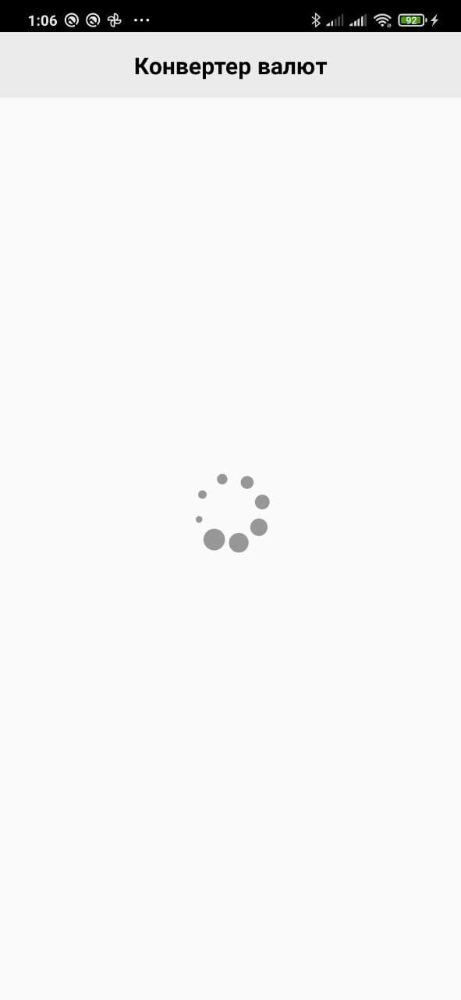

# Converter
## Экран выбора валюты
 

## Экран загрузки данных

Splash screen (сделан по гайду https://youtu.be/WZWr0Abomfw)
Да, использование таймеров - не самый хороший подход, но позволяет сделать кастомный дизайн. Первоначальный вариант экрана загрузки предполагал использование XML drawable в res/drawable, где задавались цвет фона и изображение, и кастомная тема, где в качестве фона был XML drawable. Однако сложность заключалась в добавлении тулбара. 

 ## Экран калькулятора
 
 
 
